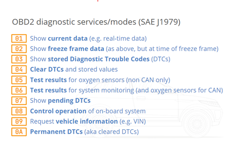

# On-board Diagnostics II (OBD2)

OBD2 (On-board Diagnostics II) is a higher-layer protocol for encoding and decoding a vehicle’s engine health parameters and engineering values. It was originally developed to track road vehicle emissions, and while it still fulfills this purpose, it has also been co-opted as a tool for diagnosing a vehicle’s engine status. For example, when a vehicle’s check engine light activates, this is because the OBD2 system has detected an invalid or critical value for a parameter, which requires maintenance. These parameters can be read from the vehicle’s OBD2 connector port and used by engineers to more accurately diagnose any engine occurred problems or malfunctions. Some examples of information which can be gathered from a reading of a vehicle’s OBD2 data include but are not limited to 

<ul>
    <li> Fuel Pressure </li>
    <li> Engine Load </li>
    <li> Coolant Temperature </li>
    <li> Engine RPM </li>
    <li> Oil Temperature </li>
    <li> Oxygen Sensor Data </li>
</ul>

# The CAN Bus

CAN (Controller Area Network) is the current standard for internal transmissions of data between a vehicle’s ECUs (Electronic Control Units). It acts as a lower-level protocol equivalent to the physical and data link layers of the OSI seven-layer model. The CAN bus handles the format and transmission of data by encapsulating the information in a frame. Each frame composes one message, which must be decoded following the decoding rules of an upper-layer protocol, such as OBD2. 

To send a CAN frame, the data is first encoded into hexadecimal values unique to each ECU, appended as the data field of a CAN message, and then transmitted through the vehicle’s internal CAN bus. There, it can be received by any ECU or device listening to the bus, which may choose to receive or ignore the message. 

The rules used to decode a CAN Message are usually kept in a proprietary database file called a DBC file. These databases contain the rules for decoding the hexadecimal values of a CAN message into the original physical engineering values. These rules are, however, proprietary to each vehicle, and as a result, the decoding of a CAN Message is a complicated process, and the DBC file needed to do so may not always be available. 

Unlike most upper-layer CAN protocols, the decoding rules of OBD2 data are mostly standardized, meaning that anyone with access to a vehicle’s OBD2 connector can decode and read diagnostic data from a vehicle’s CAN bus. The data contained within an OBD2 frame is limited to engine diagnostic data – however, this information is still of importance in the development of vehicle telematics, diagnostics, and analysis platforms. 

# CAN Frame Structure

While the rules for decoding non-standardized CAN message data bytes are usually proprietary, the format of a CAN frame itself is standardized and well-known. A CAN frame is made of binary digits which are presented in hexadecimal format as bytes. The start and end positions of these bytes are known, and collected into relevant fields of specific bit lengths, as presented below

To engineers, the most important fields are the ID field and Data field. The ID field acts as both an identifier and a priority field, used to identify which decoding rules are used to decode the data, and to assign priority – by giving lower values a higher priority. The Data portion contains the encoded physical values for the vehicle. These values are not at this point human readable.

When a CAN frame is first read, the receiver will be able to read all the above information present in hexadecimal format. However, the information contained in the data field will be encoded and present only in hexadecimal format – not human-readable engineering values. To decode this data, the decoding rules must be acquired and used to transform the data back into a human-readable format.

# DBC File Format

The decoding rules for a CAN message are contained in a database file called a DBC file. This file contains the rules needed to transform the numerical values contained in a CAN message’s data field back into their physical values and units. A portion of an OBD2 DBC file is included below

In the above example, the BO_ field specifies the CAN ID and name of the CAN message. The DBC file will match the message ID to the ID in the DBC file and use the below rules to decode the physical values. Each SG_ field below the message field corresponds to a signal which may be present in the message and can be decoded into a physical value. A single message can have multiple signals present in the data bytes portion of the frame, and the DBC file contains information on the start and end bit positions of each signal. A general overview of the format of a message and signal from a DBC file is provided below

In the case of an OBD2 DBC file, certain signals also contained important metadata, such as the length signal, which determines the length of the remaining data, and the multiplexed service and ParameterID signals, which are used to determine which of the engineering values has been transmitted such that the correct decoding rules can be applied. A general overview of an OBD2 frame format is provided below

The OBD2 protocol supports ten services, which are also known as modes. To obtain current physical data, such as Engine RPM or Coolant Temperature, mode 01, used to show current data is used. Other modes, such as mode 02, used to show freeze frame data, can be used as well, with each having a specific use in vehicle diagnostics. Not all vehicles will have support for all modes, and some vehicle manufacturers will support modes which are not present in the OBD2 standard. A more complete list of OBD2 modes is provided below

# OBD2 Request and Response

The standard type of OBD2 message covered so far is an OBD2 response message. These messages contain the physical parameters used for diagnostics. By default, however, there are no OBD2 response messages present on the CAN bus. To receive OBD2 messages, a CAN request message must be sent requesting the specific parameter. This message has a different format than a standard OBD2 message. 

An example of an OBD2 request for Engine RPM could be 7DF 02 01 0C 00 00 00 00 00. In this example, 7DF represents the CAN ID for OBD2 request messages. 02 represents the number of additional bytes of data used. 01 represents the mode used, in this case, the Show Current Data mode. 0C represents the parameter ID being requested, in this case, Engine RPM. The remaining 00 fields are simple padding which will be discarded.

This request might receive an OBD2 response, such: as 7E8 04 41 0C 0B 1A 00 00 00. In this example, 7E8 represents the CAN ID for OBD2 response messages. 04 represents the number of additional bytes of data used. 41 represents the response code, indicating that this response is for the Show Current Data mode. 0C represents the parameter ID of the Engine RPM parameter. 0B 1A is the encoded value for Engine RPM. The remaining 00s are padding which will be discarded. 

By sending request and response messages, an external or internal device connected to the CAN bus can retrieve OBD2 diagnostic data freely.

# The Future of OBD2

OBD2 was originally developed to track the emissions of gas-powered vehicles, and it still fulfills this purpose. As a result, the future of OBD2 is uncertain, as many newer electrically powered vehicles, which by their design lack emissions to track, are abstaining from including OBD2 or an OBD2 equivalent. In the coming years, the use of OBD2 as a diagnostic system may be supplanted by an alternative, modified or reduced, or replaced. 

# Overview 

OBD2 (On-board Diagnostics II) is an upper layer protocol for a vehicle's CAN (Controller Area Network) bus. It is used to transmit engine diagnostic data between the vehicle’s ECUs (Electronic Control Units). To transmit this data, the physical engineering values such as coolant temperature and engine RPM are first encoded and stored as hexadecimal values. These values are encapsulated into the data field of a CAN frame. This frame is transmitted and received by listening devices on the CAN bus. To decapsulate and decode the OBD2 data field, decoding rules which are contained in a DBC file must be obtained. OBD2 data is mostly standardized, and the decoding rules are publicly available, but this is not the case for most vehicular communications on the CAN bus. Once the decoding rules are obtained, the CAN message can be decoded into signals, each of which will contain the original values for the vehicle’s diagnostic data. 

This data, once obtained, can be used for diagnostic data, vehicle performance measurement, online telematics analysis and graphing, predictive maintenance, and more.

# Further Reading 

Additional information on OBD2 and CAN may be found at the following locations:

https://www.csselectronics.com/pages/can-bus-simple-intro-tutorial

https://www.csselectronics.com/pages/obd2-explained-simple-intro

https://www.csselectronics.com/pages/can-dbc-file-database-intro 

https://en.wikipedia.org/wiki/On-board_diagnostics

https://en.wikipedia.org/wiki/CAN_bus

https://en.wikipedia.org/wiki/OBD-II_PIDs

