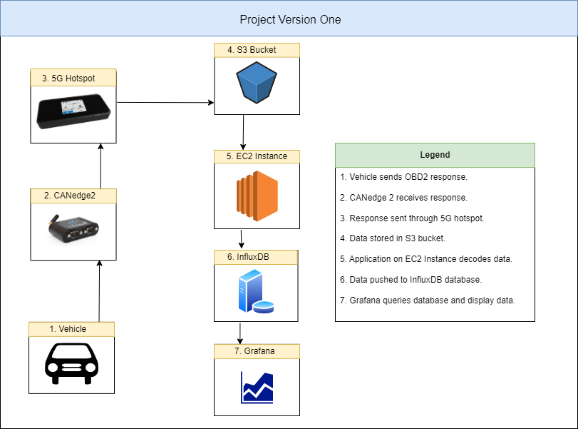
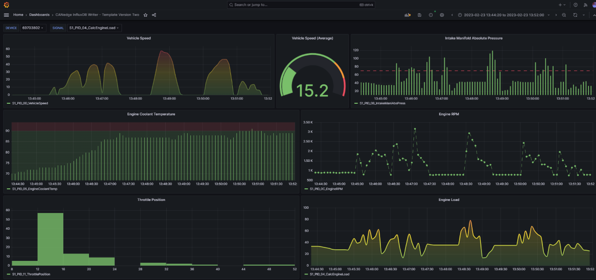

# What is this directory? 

This directory contains diagrams related to the first version of the OBD2 Vehicle Data platform. 

# What is the structure of this version of the Vehicle Data Platform? 

The steps of this version are as follows: 

1. CANedge2 recorder sends OBD2 request into vehicle CAN bus. 

2. Vehicle sends OBD2 response to CANedge2 recorder. 

3. CANedge2 pushes OBD2 encoded OBD2 data to S3 bucket through 5G hotspot. 

4. EC2 Instance hosted Python script loads and decodes OBD2 data from S3 bucket. 

5. EC2 Instance host Python script pushes decoded OBD2 data into time series database. 

6. Dashboard application queries time series database to create OBD2 data dashboards. 

<h1> Vehicle Data Platform First Iteration Architecture </h1>

<h1> Grafana Dashboards from Captured Data </h1>

