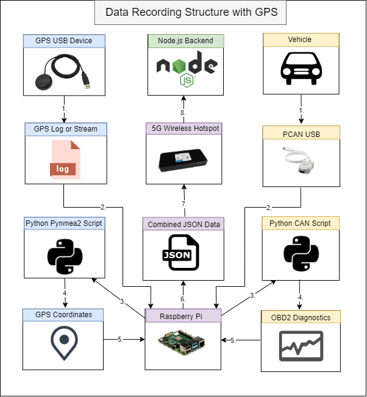
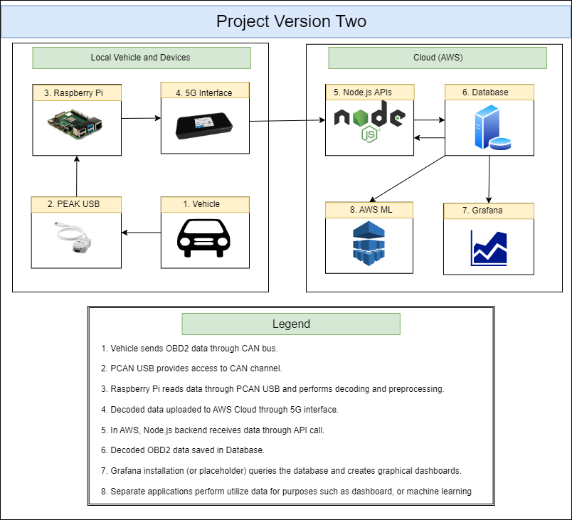
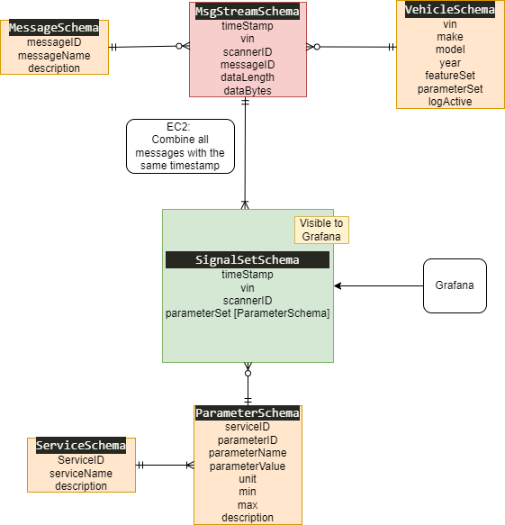

# What is in this directory? 

This directory contains diagrams for the second version of the Vehicle Data Platform. 

# What is the structure of this version of the platform? 

While the first version of the vehicle data platform utilized pre-configured cloud services and devices, this version is focused on providing a usable and scalable example of a data collection and access service using custom-written applications, scripts, and customized cloud databases. 

This system should be considered a proof of concept, which could later be improved upon by compiling the various hardware components into an embedded system - the likes of which is expected to be present on future vehicles. 

The general steps for data collection using this platform are: 

1. Python script running on Raspberry Pi periodically (30-sec intervals) sends OBD2 requests into the vehicle through the OBD2 port and listens for responses.

2. Python script receives OBD2 responses. After all, requests have been answered or timeout (30 seconds) has occurred, saves responses into time and location stamped dictionary, performs preprocessing, and checks for critical diagnostic values. Continues to send and listen for OBD2 answers. 

3. After five minutes of recording, the Python script attaches vehicle data (VIN, make, model, year) to the dictionary and pushes saved OBD2 data to the Node.js backend. 

4. Node.js backend receives OBD2 data and performs processing. Afterwards, data is saved to the MongoDB database organized by vehicle data. 

5. Data saved in the MongoDB database is accessible for processing in dashboards, machine learning, and predictive maintenance. 

# Data Process for GPS Data Integration 

# Vehicle Data Platform Iteration Two 

# MongoDB Database Schema 

